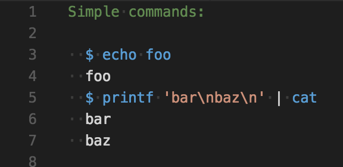

# Cram README

[Cram](https://pypi.python.org/pypi/cram) is a functional testing framework for command line applications. Cram tests look like snippets of interactive shell sessions. Cram runs each command and compares the command output in the test with the command’s actual output.

## Features

The extension provides a syntax definition for the Cram language.

The syntax definition is a superset of bash. Cram only has a simple markers indented at column 3 (two spaces indentation), to differentiate command lines (which start with `'$'`) to expected output lines. Like in bash, you can also have commands spread on multiple lines marking the command line with the `'>'` character instead. Comments lines bare no indentation and they can be written with ease.

For example, this is how the extension is highlighted in VS Code:

> Note: Writing cram files could be very sensitive to editor settings and make sure you have any kind of auto-formatting disabled such as tabs/spaces indentation, EOLs,

## Known Issues

Language syntax issues:
- commands using multi-line strings
- commands declaring multi-line functions

## Release Notes

### 0.1.0

First public cram language support in VSCode for basic syntax highlight.

## Planned features:
- Test runner integration

## License

[MIT](LICENSE)

**Enjoy!**